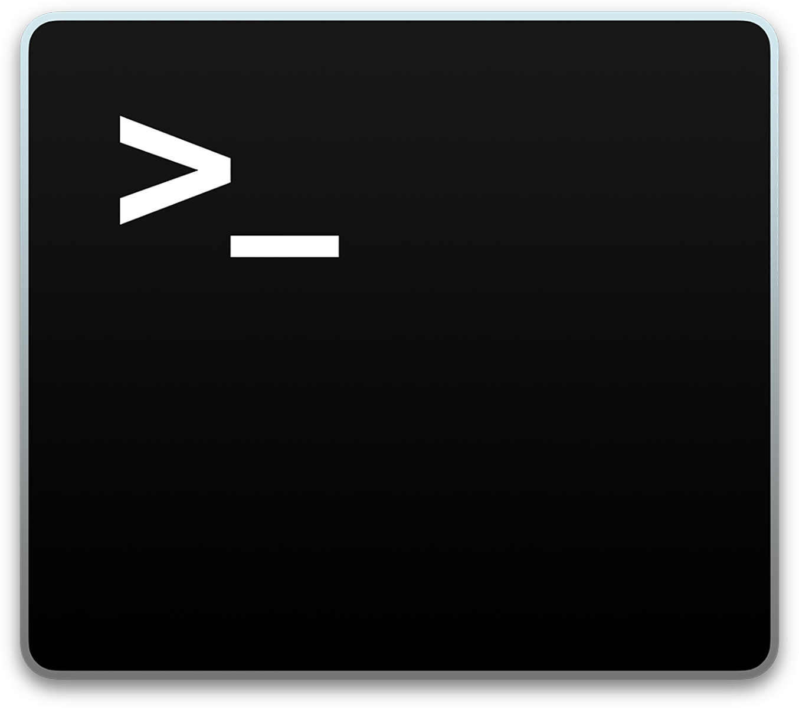

import featuredImage from "./terminal.png";

export const frontmatter = {
  title: 'Cool Bash Tricks for Your Terminal\'s "Dotfiles"',
  date: "2018-12-10 20:01:50-0400",
  description:
    "Bashfiles usually contain shortcuts compatible with Bash terminals to automate convoluted commands. Here's a summary of the ones I find most helpful that you can add to your own .bash_profile or .bashrc file.",
  tags: ["Dotfiles", "Hacks", "macOS", "Programming", "Terminal", "Tutorial"],
  image: featuredImage.src,
};



You may have noticed the recent trend of techies [posting their "dotfiles" on GitHub](https://github.com/topics/dotfiles) for the world to see. These usually contain shortcuts compatible with Bash terminals to automate convoluted commands that, I'll admit, I needed to Google every single time.

My [full dotfiles are posted at this Git repository](https://github.com/filoupegase/dotfiles), but here's a summary of the ones I find most helpful that you can add to your own `.bash_profile` or `.bashrc` file.

---

Check your current local IP address:

```bash
alias iplocal="ipconfig getifaddr en0"
```

Make a new directory and change directories into it.

```bash
mkcd() {
  mkdir -p "$1" && cd "$1"
}
```

Quickly open a Bash prompt in a running Docker container:

```bash
docker-bash() {
    docker exec -ti $1 /bin/bash
}
```

Pull updates for all Docker images with the tag "latest":

```bash
alias docker-latest="docker images --format '{{.Repository}}:{{.Tag}}' | grep :latest | xargs -L1 docker pull"
```

This odd hack is needed to run any of these aliases as sudo:

```bash
alias sudo="sudo "
```

---

[View all of my dotfiles here](https://github.com/filoupegase/dotfiles) or [check out other cool programmers' dotfiles over at this amazing collection](https://dotfiles.github.io/).
